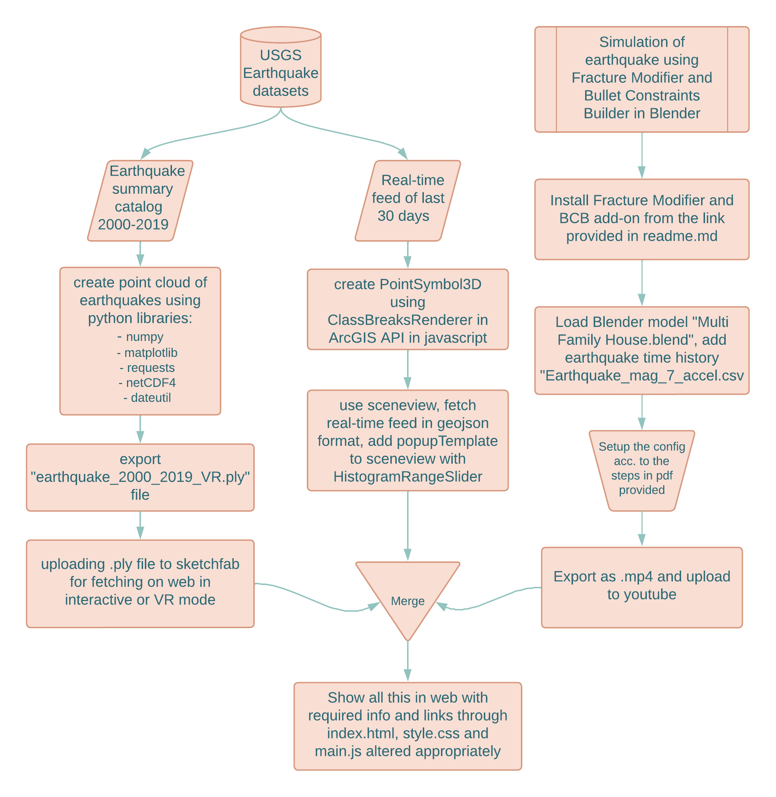
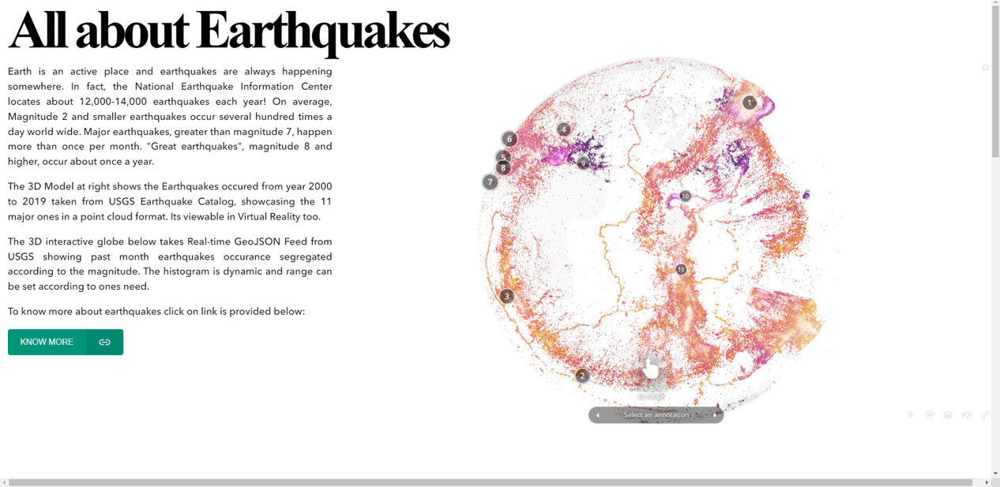
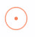
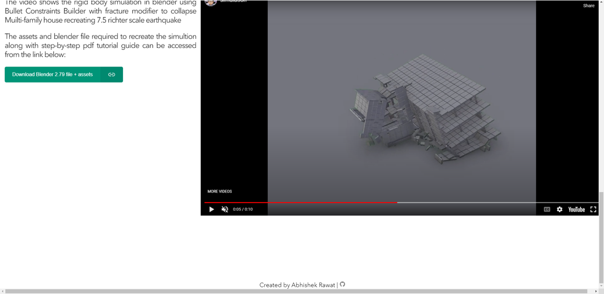
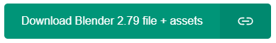
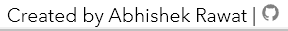

# Module-EADGI-Project-All about Earthquakes

### Introduction

Contains html file showcasing Earthquake related data generated in the form of VR model, ArcGIS API with real-time earthquake feed and video of simulation of  earthquake generated in blender.

The idea is to create an all inclusive website showcasing earthquakes happening all around the globe and information about it. This project is a part of our module work where the goal was to create:

* Web based 3D visualization
* Dynamic Simulation and visualization
* Application of VR in geospatial domains

| Folder Name  | Details                                                                                                                                                                 | Files                                                                                                               |
| ------------ | ----------------------------------------------------------------------------------------------------------------------------------------------------------------------- | ------------------------------------------------------------------------------------------------------------------- |
| Website Code | Has the main html/css/javascript file for the website                                                                                                                   | index.html, style.css, main.js                                                                                      |
| VR model     | Contains the python file for generating .ply file of point cloud of earthquake data. Additonally .ply file is also provided for quick viewing in any supported software | model_VR.py, earthquake_2000_2019_VR.ply                                                                            |
| image/README | Contains images used in README.md                                                                                                                                       | 1.png, 2.png, 3.png, button.png, footer.png, large_legend.png, medium_legend.png, small_legend.png, methodology.png |

### Methodology

The methodology followed for the project can be viewed below:



Methodology focuses on covering all the stated objectives while also focusing on achieving the goal of educating and gaining knowledge about earthquakes more!

### Description

The initial/hero page of the website focuses on basic info about earthquakes and showing a 3D model of geolocated point cloud earthquake data which is color coded according to the intensity of the earthquake.



Sketchfab was used to offload the .ply file generated from the python code "model_VR.py". The benefit of this is that it can be natively viewed in VR view too, provided one needs tools/devices supporting VR. The "KNOW MORE" button is a link to National Geographic Earthquake learning catalogue where various articles/blogs/news/reports are there to get an in-depth knowledge about earthquakes and the science behind it.

This is the -> [link](https://sketchfab.com/models/894ad84ceb8b444a91fbc05f20530bcd/embed?autostart=1&camera=0&transparent=1&ui_infos=0&ui_watermark=0) to the 3D model above.

The next part is to show real time feed via ArcGIS API. The goal is to create a modular globe view with changing labels according to the range of magnitude of earthquakes:

| Magnitude  | Description                                                                          | Legend                                         |
| ---------- | ------------------------------------------------------------------------------------ | ---------------------------------------------- |
| < 5.0      | They don't cause any significant damage.                                             |   |
| 5.0 - 7.0 | They can damage buildings and other structures in populated areas.                   |  |
| > 7.0      | These earthquakes are likely to cause damage even to earthquake resistant structures |   |

This is a recreation of an ESRI 3D visualization lesson which can be accessed via the [link](https://www.esri.com/arcgis-blog/products/js-api-arcgis/3d-gis/a-classical-visualization-of-earthquakes-using-arcgis-api-for-javascript/). Basic methodology to create this visualization is:

* Create the map: contains the vintage basemap from John Nelson loaded as a TileLayer. See the code for this on [Github](https://github.com/RalucaNicola/JSAPI_demos/blob/master/last-earthquakes/main.js#L18) (lines 18–28).
* Create the [SceneView](https://developers.arcgis.com/javascript/latest/api-reference/esri-views-SceneView.html) that the map will be rendered to. On the [SceneView](https://developers.arcgis.com/javascript/latest/api-reference/esri-views-SceneView.html) there are several properties related to the user interaction, like the [navigation constraints](https://developers.arcgis.com/javascript/latest/api-reference/esri-views-SceneView.html#constraints), the color of the [highlight](https://developers.arcgis.com/javascript/latest/api-reference/esri-views-SceneView.html#highlightOptions) when the user clicks on an earthquake, the [environment settings](https://developers.arcgis.com/javascript/latest/api-reference/esri-views-SceneView.html#environment) for the lighting in the scene and removing the stars and the sky and making it transparent. See the code for this on [Github](https://github.com/RalucaNicola/JSAPI_demos/blob/master/last-earthquakes/main.js#L30) (lines 30–60).
* Create the [GeoJSONLayer](https://developers.arcgis.com/javascript/latest/api-reference/esri-layers-GeoJSONLayer.html) with the earthquakes. The[ popupTemplate](https://developers.arcgis.com/javascript/latest/api-reference/esri-layers-GeoJSONLayer.html#popupTemplate) sets the information that should be displayed when the user clicks on the earthquake. In this case, we want to show the magnitude of the earthquake, where it happened and what time it happened. We want the size to represent the magnitude of the earthquakes and no be influenced by perspective, so we’re going to set `screenSizePerspectiveEnabled` to `false`. See the code for this on [Github](https://github.com/RalucaNicola/JSAPI_demos/blob/master/last-earthquakes/main.js#L68) (lines 68–89).
* The next part of the code is about setting the renderer on the layer. The data is split into 3 classes based on magnitude as discussed in Step 1, so we’re going to use a [ClassBreaksRenderer](https://developers.arcgis.com/javascript/latest/api-reference/esri-renderers-ClassBreaksRenderer.html). For each of the classes we want to count how many earthquakes are in each class, so we define [outStatistics definitions](https://github.com/RalucaNicola/JSAPI_demos/blob/master/last-earthquakes/main.js#L93) that we later on pass to the [layer query](https://github.com/RalucaNicola/JSAPI_demos/blob/master/last-earthquakes/main.js#L139). Once we get the results from the statistics, we define the renderer. See the code for this on [Github](https://github.com/RalucaNicola/JSAPI_demos/blob/master/last-earthquakes/main.js#L142) (lines 142–176).
* Finally, the [HistogramRangeSlider](https://developers.arcgis.com/javascript/latest/api-reference/esri-widgets-HistogramRangeSlider.html) needs to know how many features are in each histogram bin. We can get that information using the smart mapping [histogram](https://developers.arcgis.com/javascript/latest/api-reference/esri-renderers-smartMapping-statistics-histogram.html) method. Once the histogram slider is created, we define an event listener that will filter the data on the layer view when the user drags the thumbs of the slider. See the code for this on [Github](https://github.com/RalucaNicola/JSAPI_demos/blob/master/last-earthquakes/main.js#L193) (lines 193 — 233).

After that the website will look somewhat like this(I have changed the basetilelayer in the code and changed some parameters so the view might look different):


The final stage is to create a simulation to show how earthquakes affect structures in real life. Due to time and computational limitation, the simulation was only done for one building with limited parameters in blender. One can increase the complexity and poly-count geometries accordingly. The ->[link](https://drive.google.com/drive/folders/19yK-l_flvEnTnqqOlYROZv1GDM9VkEqJ)<- to assets and blender software is given. One can even use different software's like [Houdini-SideFX](https://www.sidefx.com/gallery/houdini-earthquake-house-collapse-rnd/) and [Unity](https://github.com/ertanturan/Unity-Earthquake-Simulation).



The simulation was exported and uploaded to YouTube for website fetching. Link to the video -> [Simulation.mp4](https://www.youtube.com/embed/-Axoi7aW4Is?autoplay=0&mute=0)

##### Additional things



**Buttons**

They were used for linking different wbsites and url. This was used for off-loading assets for simualation. The code framework of which is shown below:

html code

```
<button type="button" class="button" onclick=" window.open('https://drive.google.com/drive/folders/19yK-l_flvEnTnqqOlYROZv1GDM9VkEqJ?usp=sharing','_blank')">
                <span class="button__text">Download Blender 2.79 file + assets</span>
                <span class="button__icon">
                    <ion-icon name="link-outline"></ion-icon>
                </span>
            </button>
```

css code

```
.button {
    display: flex;
    height: 50px;
    padding: 0;
    background: #009578;
    border: none;
    outline: none;
    border-radius: 5px;
    overflow: hidden;
    font-family: "Quicksand", sans-serif;
    font-size: 16px;
    font-weight: 500;
    cursor: pointer;
  }
  
  .button:hover {
    background: #008168;
  }
  
  .button:active {
    background: #006e58;
  }
  
  .button__text,
  .button__icon {
    display: inline-flex;
    align-items: center;
    padding: 0 24px;
    color: #fff;
    height: 100%;
  }
  
  .button__icon {
    font-size: 1.5em;
    background: rgba(0, 0, 0, 0.08);
  }
```

For further clarification one can refer the [tutorial](https://www.youtube.com/watch?v=A7G-kAyfxqY&t=49s).



**Footer with name and GitHub logo**

Created using footer functionality and the same [tutorial](https://www.youtube.com/watch?v=A7G-kAyfxqY&t=49s) mentioned above. Below is the code snippet:

```
<footer>
        <div class="h8" style="position: relative;">Created by Abhishek Rawat |
        <!-- GITHUB Link of repository of this code -->
        <a class="social_icon" href="https://github.com/AiM0-create/Module-AEGD-Project" target="_blank"> 
            <ion-icon name="logo-github"></ion-icon>
        </a>
        </div>
    </footer>
```

### References

1. A classical visualization of earthquakes using ArcGIS API for
   JavaScript. (n.d.). Retrieved June 9, 2022, from
   https://www.esri.com/arcgis-blog/products/js-api-arcgis/3d-gis/a-classical-visualization-of-earthquakes-using-arcgis-api-for-javascript/
2. API Documentation - Earthquake Catalog. (n.d.). Retrieved
   June 9, 2022, from https://earthquake.usgs.gov/fdsnws/event/1/
3. Blender Fracture Modifier – Simply Explained | All3DP.
   (n.d.). Retrieved June 9, 2022, from
   https://all3dp.com/2/blender-fracture-modifier/
4. GeoJSON Summary Format. (n.d.). Retrieved June 9, 2022, from
   https://earthquake.usgs.gov/earthquakes/feed/v1.0/geojson.php
5. GitHub - KaiKostack/bullet-constraints-builder: Add-on for
   Blender to connect rigid bodies via constraints in a physical plausible way.
   (You only need the ZIP file for installation in Blender. Click the filename and
   at the next page “Download”, right click and “Save As” won’t work!). (n.d.).
   Retrieved June 9, 2022, from
   https://github.com/KaiKostack/bullet-constraints-builder

### Conclusion

The project has lot of scope of improvement so if you want to collab, raise issue with the code or even reuse the code feel free to do so.

Contact: [LinkedIn](https://www.linkedin.com/in/abhishek-rawat-9795a914a/)

---
