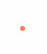
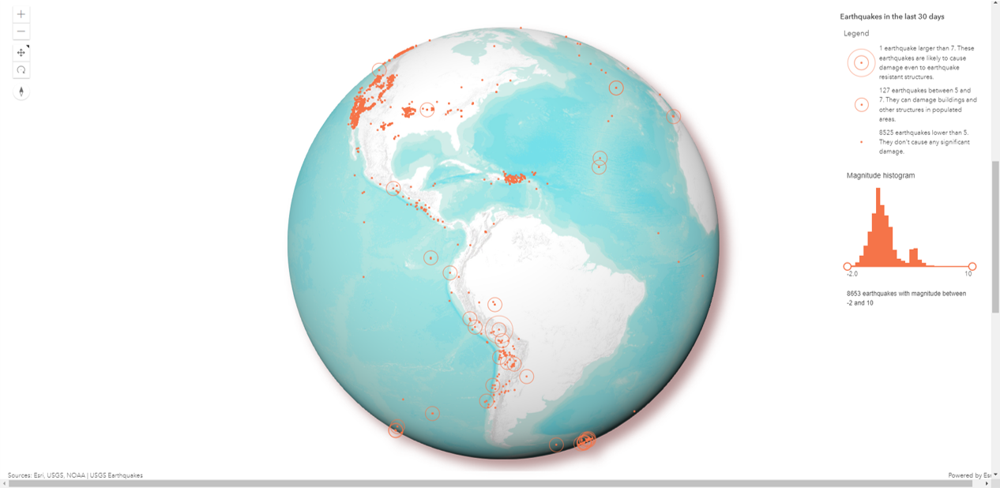

# Module-AEGD-Project-All about Earthquakes

Contains html file showcasing Earthquake related data generated in the form of VR modles, three.js globe with real-time earthquake feed and video of simulation of earthquake generated in blender.

The idea is to create an all inclusive website showcasing earthquakes happening all around the globe and information about it. This project is a part of our module work where the goal was to create:

* Web based 3D visualization
* Dynamic Simulation and visualization
* Application of VR in geospatial domains

### Methodology

The methodology followed for the project can be viewed below:


Methodology focuses on covering all the stated objectives while also focusing on achieving the goal of educating and gaining knwoledge about earthquakes more!

### Description

The initial/hero page of the website focuses on basic info about earthquakes and showing a 3D model of geolocated point cloud earthquake data which is color coded according to the intensity of the earthquake.


Sketchfab was used to offload the .ply file generated from the python code "model_VR.py". The benifit of this is that it can be natively viewed in VR view too, provided one needs tools/devices supporting VR. The "KNOW MORE" button is a link to National Geographic Earthquake learning catalog where various articles/blogs/news/reports are there to get an indepth knowledge about earthquakes and the science behind it. 

<div class="sketchfab-embed-wrapper" style="float: right; clear: right"> <iframe title="Earthquakes - 2000 to 2019" frameborder="0" allowfullscreen mozallowfullscreen="true" webkitallowfullscreen="true" allow="autoplay; fullscreen; xr-spatial-tracking" xr-spatial-tracking execution-while-out-of-viewport execution-while-not-rendered web-share width="1280" height="720" src="https://sketchfab.com/models/894ad84ceb8b444a91fbc05f20530bcd/embed?autostart=1&camera=0&transparent=1&ui_infos=0&ui_watermark=0" align="right"> </iframe> 

Below is the interactive part to show the features it shows. One can replicate this by cloning model_VR.py and parameters can be altered accordingly.

```
<div class="sketchfab-embed-wrapper" style="float: right; clear: right"> <iframe title="Earthquakes - 2000 to 2019" frameborder="0" allowfullscreen mozallowfullscreen="true" webkitallowfullscreen="true" allow="autoplay; fullscreen; xr-spatial-tracking" xr-spatial-tracking execution-while-out-of-viewport execution-while-not-rendered web-share width="1280" height="720" src="https://sketchfab.com/models/894ad84ceb8b444a91fbc05f20530bcd/embed?autostart=1&camera=0&transparent=1&ui_infos=0&ui_watermark=0" align="right"> </iframe> 

```

The next part is to show real time feed via ArcGIS API. The goal is to create a modular globe view with changing labels according to the range of magnitude of earthquakes:

| Magnitude  | Description                                                                         | Legend                                         |
| ---------- | ----------------------------------------------------------------------------------- | ---------------------------------------------- |
| < 5.0      | They don't cause any significant damage.                                            |  |
| 5.0 - 7.0 | They can damage buildings and other structures in populated areas.                  |  |
| > 7,0      | These earthquakes are likely to case damage even to earthquake resistant structures |  |

This is a recreation of an ESRI 3D visualization lesson which can be accessed via the [link](https://www.esri.com/arcgis-blog/products/js-api-arcgis/3d-gis/a-classical-visualization-of-earthquakes-using-arcgis-api-for-javascript/). Basic methodlogy to create this visualization is:

* Create the map: contains the vintage basemap from John Nelson loaded as a TileLayer. See the code for this on [Github](https://github.com/RalucaNicola/JSAPI_demos/blob/master/last-earthquakes/main.js#L18) (lines 18–28).
* Create the [SceneView](https://developers.arcgis.com/javascript/latest/api-reference/esri-views-SceneView.html) that the map will be rendered to. On the [SceneView](https://developers.arcgis.com/javascript/latest/api-reference/esri-views-SceneView.html) there are several properties related to the user interaction, like the [navigation constraints](https://developers.arcgis.com/javascript/latest/api-reference/esri-views-SceneView.html#constraints), the color of the [highlight](https://developers.arcgis.com/javascript/latest/api-reference/esri-views-SceneView.html#highlightOptions) when the user clicks on an earthquake, the [environment settings](https://developers.arcgis.com/javascript/latest/api-reference/esri-views-SceneView.html#environment) for the lighting in the scene and removing the stars and the sky and making it transparent. See the code for this on [Github](https://github.com/RalucaNicola/JSAPI_demos/blob/master/last-earthquakes/main.js#L30) (lines 30–60).
* Create the [GeoJSONLayer](https://developers.arcgis.com/javascript/latest/api-reference/esri-layers-GeoJSONLayer.html) with the earthquakes. The[ popupTemplate](https://developers.arcgis.com/javascript/latest/api-reference/esri-layers-GeoJSONLayer.html#popupTemplate) sets the information that should be displayed when the user clicks on the earthquake. In this case, we want to show the magnitude of the earthquake, where it happened and what time it happened. We want the size to represent the magnitude of the earthquakes and no be influenced by perspective, so we’re going to set `screenSizePerspectiveEnabled` to `false`. See the code for this on [Github](https://github.com/RalucaNicola/JSAPI_demos/blob/master/last-earthquakes/main.js#L68) (lines 68–89).
* The next part of the code is about setting the renderer on the layer. The data is split into 3 classes based on magnitude as discussed in Step 1, so we’re going to use a [ClassBreaksRenderer](https://developers.arcgis.com/javascript/latest/api-reference/esri-renderers-ClassBreaksRenderer.html). For each of the classes we want to count how many earthquakes are in each class, so we define [outStatistics definitions](https://github.com/RalucaNicola/JSAPI_demos/blob/master/last-earthquakes/main.js#L93) that we later on pass to the [layer query](https://github.com/RalucaNicola/JSAPI_demos/blob/master/last-earthquakes/main.js#L139). Once we get the results from the statistics, we define the renderer. See the code for this on [Github](https://github.com/RalucaNicola/JSAPI_demos/blob/master/last-earthquakes/main.js#L142) (lines 142–176).
* Finally, the [HistogramRangeSlider](https://developers.arcgis.com/javascript/latest/api-reference/esri-widgets-HistogramRangeSlider.html) needs to know how many features are in each histogram bin. We can get that information using the smart mapping [histogram](https://developers.arcgis.com/javascript/latest/api-reference/esri-renderers-smartMapping-statistics-histogram.html) method. Once the histogram slider is created, we define an event listener that will filter the data on the layer view when the user drags the thumbs of the slider. See the code for this on [Github](https://github.com/RalucaNicola/JSAPI_demos/blob/master/last-earthquakes/main.js#L193) (lines 193 — 233).

After that the website will look somewhat like this(I have changed the basetilelayer in the code and changed some parameters so the view might look different):



Below you can play with the interactive map.

```
<!-- Setting up dynamic histogram -->
    <div id="viewDiv">
      <div id="sidePanelInfo">
        <div id="legend"></div>
        <div id="histContainer">
          <div class="title">Magnitude histogram</div>
          <div id="histogram"></div>
          <div class="description" id="histCount"></div>
        </div>
      </div>
```

The final stage is to create a simulation to show

---
